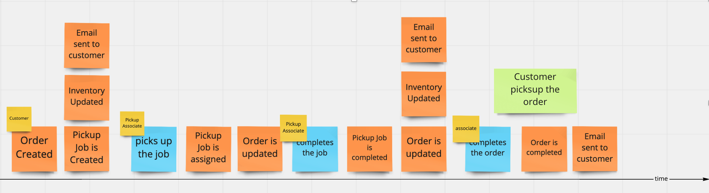
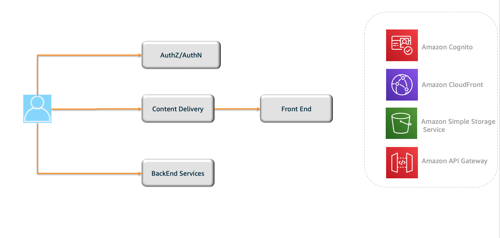

Buy Online Pickup At Store[BOPIS]- AWS Serverless
=================================

__Status__: _Work-in-progress. Please create issues or pull requests if you have ideas for improvement._

The __Buy Online Pickup At Store__ is a sample implementation of a event driven serverless application for buy online pickup at store application. Event-driven microservices increase building highly cohesive components with low coupling. It also allows adding new capabilities easily. Some of the services used in the architecture are 
- [Amazon EventBridge](https://aws.amazon.com/eventbridge/)
- [Amazon ApiGateway](https://aws.amazon.com/eventbridge/)
- [AWS Lambda](https://aws.amazon.com/eventbridge/)
- [Amazon DynamoDB](https://aws.amazon.com/eventbridge/)

## Domain

_Buy Online Pickup At Store_ offers frictionless experience for customers to who are shopping online and in-store. It bridges the gap for brick-and-mortar retail customers from offering a convenient shopping experience.

<p align="center">
  
</p>

<p align="center">
  
</p>

## BackEnd Architecture
High-level overview of how microservices interact with each other through an event router.
<p align="center">
  
</p>

## Frontend 

|  Services  | Description                               |
|------------|-------------------------------------------|
| [pickup-ui](pickup-ui/) | UI application used by store associates |
| [retail-ui](retail-ui/) | UI application used by customers |

## Getting Started
### Prerequisites
- NodeJs
- NPM
- aws-cli
- Uses SES for email. Make sure the sender email is a verified email

### Manual Deployment

#### BackEnd 

- Clone the repo.
Login to AWS Environment through command line[aws-cli]()

- Follow the steps here. Use default parameters wherever applicable
```
cd base 
sam deploy --stack-name boppis-base --capabilities CAPABILITY_IAM --region us-east-1 -g
cd ../orders

#Deploy Orders DB stack
sam deploy --stack-name boppis-orders-db --capabilities CAPABILITY_IAM --region us-east-1 --template-file db.yml -g

#Deploy orders services stack
sam build -t app.yml
sam deploy --stack-name boppis-orders-app --capabilities CAPABILITY_IAM --region us-east-1 --template-file app.yml -g

cd ../product
sam build 
sam deploy  --stack-name boppis-product --capabilities CAPABILITY_IAM --region us-east-1 --template-file template.yml -g

cd ../pickup
sam build 
sam deploy --stack-name boppis-pickup --capabilities CAPABILITY_IAM --region us-east-1 --template-file template.yml -g

```
#### UI
UI is built using amplify. The stacks will deploy the amplify application. Once successfully built, Login to AWS /Amplify Console and Run build.
Make sure to replace the repo and oauth token.

```
aws cloudformation deploy --template-file template.yml  --stack-name boppis-pickup-ui  --region us-east-1 --parameter-overrides Repository=https://<<GIT_REPO>> OauthToken=<<OAUTH_TOKEN>>  --capabilities CAPABILITY_IAM

aws cloudformation deploy --template-file template.yml  --stack-name boppis-retail-ui  --region us-east-1 --parameter-overrides Repository=https://<<GIT_REPO>> OauthToken=<<OAUTH_TOKEN>>   --capabilities CAPABILITY_IAM

```

##### Load product data for testing
```
cd base
npm install
node load_product.js
```

#### BackEnd (CICD)
Refer [Pipeline Doc](./pipeline/README.md)

## License

This library is licensed under the MIT-0 License. See the LICENSE file.